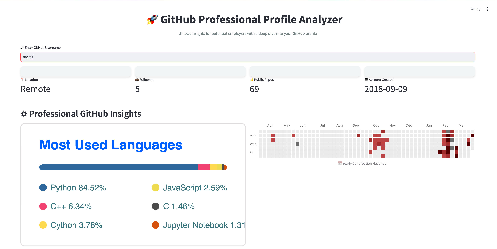
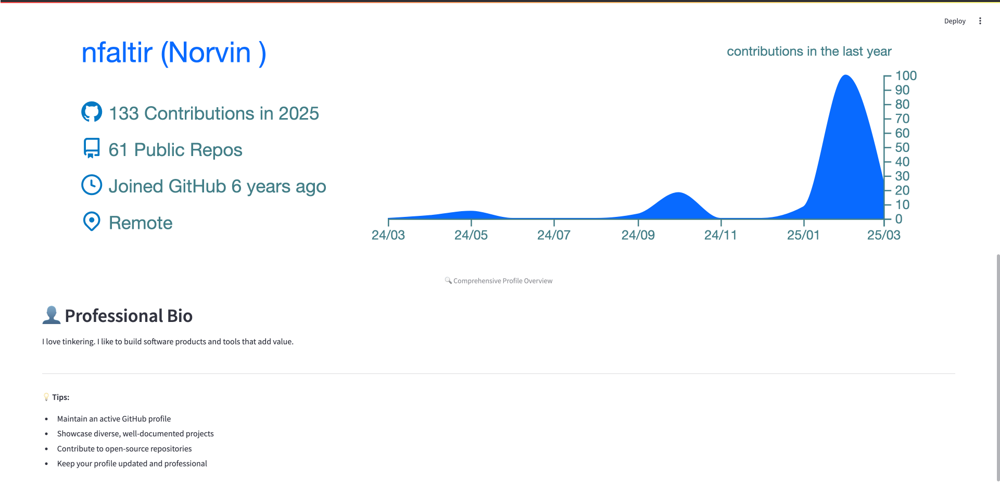

# Github Stats

<br>

## Overview

 - App allows anyone to fetch any valid Github user's statistics.
 - The github api comes with many themes, you can change it on `line 4`

 themes
 ```bash
github_readme_stats_themes = [
    # Light Themes
    "default",       # Standard light gray theme
    "transparent",   # Transparent background
    "dracula",       # Dark purple/pink theme
    "radical",       # Vibrant gradient theme
    "merko",         # Green-based theme
    "gruvbox",       # Earthy color palette
    "tokyonight",    # Dark blue with neon accents
    "onedark",       # Popular VS Code-inspired dark theme
    "cobalt",        # Deep blue theme
    "synthwave84",   # 80s retro-style theme
    "highcontrast",  # High contrast black and white
    
    # Dark Themes
    "dark",          # Standard dark theme
    "nord",          # Cool blue-gray Nordic theme
    "nightowl",      # Deep dark theme with blue accents
    "vision-friendly-dark",  # Accessibility-focused dark theme
    
    # Colorful Themes
    "prussian",      # Blue-based military style theme
    "vue",           # Green and white theme
    "swift",         # Apple-inspired theme
    "algolia",       # Modern, clean theme
    
    # Unique Themes
    "calm",          # Soft, muted colors
    "chartreuse-dark",  # Lime green and dark theme
    "monokai",       # Classic programming theme
]

# GitHub Profile Summary Cards Themes
profile_summary_card_themes = [
    "default",       # Standard light theme
    "solarized",     # Solarized color palette
    "nord_bright",   # Bright Nordic theme
    "nord_dark",     # Dark Nordic theme
    "github",        # GitHub-inspired theme
    "github_dark",   # Dark GitHub theme
    "dracula",       # Dark purple theme
    "monokai",       # Classic programming theme
    "vue",           # Green and white theme
    "buefy",         # Light theme with soft colors
    "dark",          # Generic dark theme
]

# Contribution Chart Themes (Limited Options)
contribution_chart_themes = [
    "blue",          # Standard blue
    "green",         # Green contribution squares
    "red",           # Red contribution squares
    "purple",        # Purple contribution squares
]

print("GitHub Readme Stats Themes:", github_readme_stats_themes)
print("\nProfile Summary Card Themes:", profile_summary_card_themes)
print("\nContribution Chart Themes:", contribution_chart_themes)

 ```

 <br>




